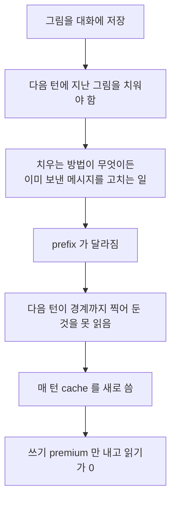

# ADR 0005 — `every_call` 의 screen capture 를 대화에 저장하지 않고 요청에만 싣는다

- 상태: 뒤집힘
- 근거: commit `a8293a7` (`fix: every_call 이 그림을 대화에 남기지 않고 요청에만 싣는다`),
  `8b2e1e4`, `d1d9d7e`, `f8806dc`
- **plan 문서가 없습니다.** 이유가 적힌 곳은 commit message 뿐입니다.
- 네 commit 은 아직 `develop` 에 없습니다 (ARTEL-868 branch). 아래에 나오는
  `app/agents/qa/vision.py`, `app/llm/chat_model.py`, `tests/test_llm_cache_point.py` 의
  상수와 코드는 **그 branch 의 것**이고, `develop` 을 체크아웃해서는 찾을 수 없습니다.

## 결정

- `screen_capture=every_call` 인 런에서 그림은 **저장되는 대화에 아예 들어가지 않습니다.**
  - 대화는 글자만 남기고 append-only 로 둡니다.
  - `awrap_model_call` 이 매 호출 그 뒤에 현재 화면 한 장을 얹었다 버립니다.
- cache 경계도 함께 옮깁니다. `_with_cache_point` 가 뒤에서부터 이번 요청에만 실린
  메시지를 건너뛰고 그 앞에 찍습니다.

## 왜

### 1. 저장한 첫 build 가 낸 숫자

첫 `every_call` build 는 그림을 대화에 저장했습니다. 파일럿에서 baseline 과 나란히 잰 값입니다.

| 무엇 | `on_demand` baseline | 저장하는 `every_call` |
| --- | --- | --- |
| cache 적중 | 97.3% | 1.3% |
| 비용 | $0.87 | $14.22 |

- **input token 은 1.25 배만 늘었습니다.** 그러니 오른 것은 token 이 아니라
  매 턴 새로 쓰고 한 번도 못 읽은 cache 입니다.

### 2. 원인은 그림을 저장한 것입니다

- 치우는 방법은 상관없습니다 — `trim_images` 처럼 글자로 바꿔 쓰든 지우든,
  **둘 다 이미 보낸 메시지를 고치는 일**입니다.
- cache 는 prefix 가 바이트까지 같을 때만 읽힙니다. 한 글자가 달라지면 그 뒤가
  전부 안 맞습니다.
- 저장하지 않으면 치울 것이 애초에 없습니다. 이것이 이 결정의 전부입니다.

### 3. 경계가 그림 뒤에 있으면 손해가 그대로 돌아옵니다

- `_with_cache_point` 는 원래 `messages[-1]` 에 찍었습니다.
- 그대로 두면 경계가 그림 **뒤**로 가고, 그림이 캐시된 prefix 안에 들어갑니다.
- 그림은 매 턴 다르므로 다음 턴의 prefix 가 또 안 맞습니다 — **자리만 옮긴 같은 손해**입니다.
- 지금은 뒤에서부터 transient 메시지를 건너뛰고 그 앞에 찍습니다. 앞의 대화는 그대로
  읽히고 그림 한 장만 정가를 냅니다.
- transient 표시는 `additional_kwargs` 의 `artel_transient` 입니다. `app/llm` 이
  `app/agents` 를 import 하지 않으려고 상수 대신 문자열을 읽습니다 — 의존은 한 방향이고,
  cache 경계를 찍자고 그것을 뒤집을 이유가 없습니다.

### 4. `capture_screen` tool 은 남습니다

- 빼면 arm 이 **두 가지로** 달라집니다 — 그림이 안 물어봐도 오는 것, 그리고
  `target_id` 로 요소 하나를 잘라 보는 능력이 사라지는 것.
- `vision_directive` 프롬프트가 그 tool 을 이름으로 부르므로, 빼면 프롬프트도 고쳐야 하고
  `prompt_version` 이 arm 마다 갈립니다. 비교가 고정해야 할 축입니다.
- 대신 tool 설명에 한 문장을 더해 화면이 이미 앞에 있다고 말합니다. 그 문장은 프롬프트
  파일이 아니라 `arch` 가 만드는 값이라 두 arm 의 `prompt_version` 이 같습니다.

### 5. 자동 capture 의 timeout 이 따로인 이유

| 상수 | 값 | 무엇 |
| --- | --- | --- |
| `ACTION_TIMEOUT_SECONDS` | 30.0 | tool 호출 하나가 기다릴 수 있는 시간 |
| `AUTO_CAPTURE_TIMEOUT_SECONDS` | 10.0 | 자동 capture 가 게임을 기다리는 시간 |
| `DOWNLOAD_TIMEOUT_SECONDS` | 15.0 | 찍힌 그림을 내려받는 시간 |

- tool capture 는 모델이 보기로 정했을 때 일어나지만 자동 capture 는 **매 호출** 붙습니다.
  호출마다 30 초 침묵이면 느린 게임이 멈춘 런과 구분되지 않습니다.
- 더 짧게도 못 잡습니다. capture 하나는 `WaitForEndOfFrame`, 인코딩, presign POST,
  S3 PUT 이고, 게임 슬롯 셋이 한 기계를 나눠 써도 10 초 안에 끝납니다. 더 줄이면
  곧 도착할 capture 를 끊게 되고, 늦게 도착한 답은 다음 action 의 답으로 읽힐 수 있습니다.
- **이 arm 이 한 호출에 더하는 대기는 10 초가 아니라 25 초입니다.** 내려받기가 따로
  15 초를 갖기 때문입니다.

## 거절한 대안

| 대안 | 왜 거절했나 |
| --- | --- |
| 그림을 대화에 저장 | 첫 build 가 골랐고 뒤집힘. cache 적중 1.3%, $14.22 |
| `trim_images` 로 지난 그림을 글자로 바꿔 씀 | 그것도 이미 보낸 메시지를 고치는 일이라 prefix 가 깨짐 |
| 경계를 `messages[-1]` 에 그대로 둠 | 그림이 캐시된 prefix 안에 들어가 같은 손해가 자리만 옮김 |
| `every_call` 에서 `capture_screen` 을 뺌 | arm 이 두 가지로 달라지고 `prompt_version` 이 갈림 |
| 자동 capture 에 `ACTION_TIMEOUT_SECONDS` 를 씀 | 호출마다 30 초 침묵이면 느린 게임과 멈춘 런이 구분 안 됨 |
| `app/llm` 이 `TRANSIENT_MESSAGE_KEY` 를 import | 의존 방향이 뒤집힘 |

## 대가

| 대가 | 무엇이 일어나나 |
| --- | --- |
| 그림이 전사에 안 남음 | 나중에 런을 다시 읽을 때 모델이 무엇을 봤는지 대화만으로는 알 수 없음 |
| `arch_fingerprint` 가 두 build 를 못 가름 | `screen_capture` 값이 같고 tool 과 middleware 도 같음. label 이 유일한 구분 — ADR 0006 참고 |
| `MAX_IMAGES_IN_REQUEST` 와 `trim_images` 가 `on_demand` 전용이 됨 | `every_call` 의 전사에는 그림이 없어 다시 보낼 것이 없음 |
| 매 호출 최대 25 초가 붙음 | `on_demand` 에서는 모델이 보기로 한 턴에만 내던 값 |
| 숫자의 출처가 commit message 뿐 | 이 저장소에 결과 파일도 런 로그도 없음 |
