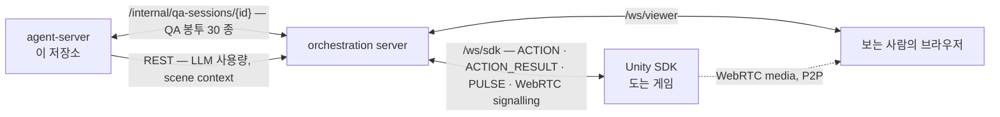
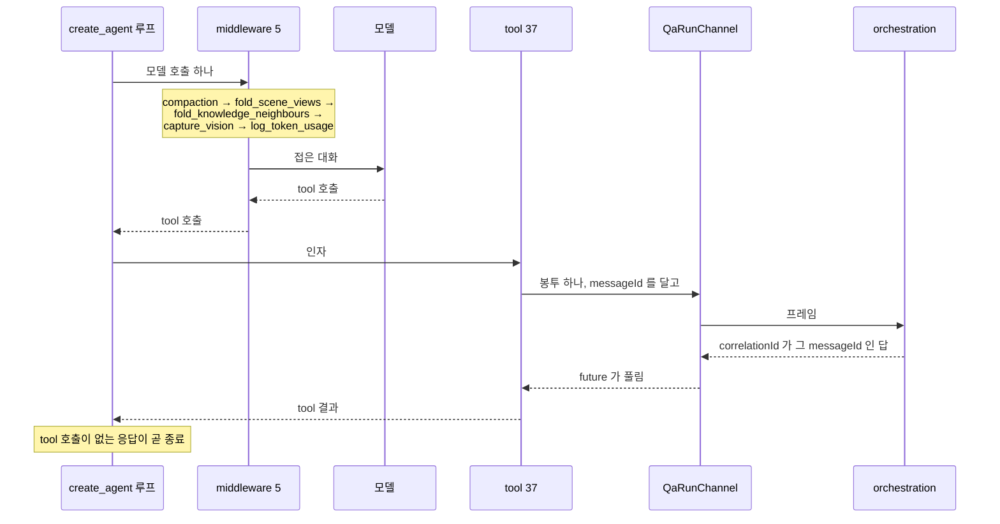

# Architecture

- `artel-agent-server` 를 이루는 것이 무엇이고 왜 그렇게 갈라져 있는지
- 모듈 목록과 파일 트리는 여기 없음
- 결정의 이유는 [`docs/adr/`](adr/README.md), 그 밖의 이유는 [`.plan/general/`](../.plan/general/)

## 네 참여자

- **이 서버는 게임에 직접 말을 걸지 않음.** 모든 조작과 관측이 orchestration 을 거침
- 그래서 여기서 보내는 `ACTION` 은 SDK 의 action 이 아니라 orchestration 이 번역할 요청임.
  SDK 쪽 계약은 `artel-sdk/docs/protocol.md`, 스트리밍은
  `artel-orchestration-server/docs/streaming-protocol.md`
- 이 서버가 orchestration 에 거는 HTTP 는 둘뿐이고 나머지는 전부 WebSocket 봉투임
- 봉투의 타입 목록과 함정은 [`docs/qa-protocol.md`](qa-protocol.md)

## agent 여섯

| agent | 무엇을 받아 무엇을 내나 | 모양 | 부르는 자리 |
| --- | --- | --- | --- |
| `qa` | 시나리오 스텝과 도는 게임 → 스텝별 판정과 발견한 결함 | tool loop | `/internal/qa-sessions/{id}` |
| `scenario` | 프로젝트 문맥과 요청 → 테스트 시나리오 | tool loop, 구조화 최종 답 | `/internal/sessions/{id}` |
| `game_context` | 기획 문서 URL → 게임 문맥 구조체 | 구조화 출력 | `POST /internal/extract` |
| `knowledge_query` | knowledge 항목 하나 → 그것을 찾아낼 질문 3 개 | 구조화 출력 | `POST /internal/knowledge-queries` |
| `screen_verdict` | selector 제안 하나 → whitelist 항목과 거절 사유 | 구조화 출력 | QA 세션이 제안을 받았을 때 |
| `step_phrasing` | 사람이 친 문장 → 다듬은 스텝 문구 | 구조화 출력 | `POST /internal/scenario-steps/phrase` |

- `scenario` 도 v2 부터 tool loop 임. 프로젝트의 테스트 케이스 목록이 프롬프트에 실려 오면
  tool 이 하나도 없어 한 턴에 끝나고, 아니면 `search_test_cases` 로 기존 것을 찾아본 뒤 답함
- `screen_verdict` 만 QA 세션 안에서 불리고 나머지 넷은 HTTP 요청 하나에 한 번 불림

### `screen_verdict` 가 QA agent 가 아닌 이유

- 판정은 몇 초짜리 질문이지만 **QA 런은 그 몇 초 동안 서 있을 수 없음**
- 게임을 하고 있는 agent 를 세워 판정시키면 기다리는 동안 게임이 흘러감
- 그 런의 문맥과 예산이 자기 시나리오와 무관한 질문에 쓰임
- 그래서 이 agent 에는 대화가 없음 — 호출 한 번, 답 하나, 끝
- 이전 제안에 뭐라고 답했는지도 기억하지 않음. 기억할 것은 whitelist 자체이고
  그것은 orchestration 이 들고 있음
- 구조화 출력이 끝내 안 나오면 지어내지 않고 `ScreenVerdictError` 로 끝냄.
  부르는 쪽이 그것을 **항목 없는 답**으로 옮김

## QA 런은 tool loop

- 루프를 도는 것은 LangChain 의 `create_agent` 이고 이 저장소가 아님.
  `create_agent` 는 **tool 호출이 없는 응답에서 루프를 끝냄**
- 그래서 런 중간의 모든 모델 호출은 직전 tool 결과 뒤에 옴. 화면을 그리는 자리가
  꼬리 메시지가 아니라 tool 결과인 이유가 이것임
- 상한이 둘 — tool 호출 수와 벽시계. 오늘 값은 배급이 아니라 폭주 방지임

| 상한 | 상수 | 값 |
| --- | --- | --- |
| 고정 tool 호출 | `BASE_TOOL_CALLS` | 1,000 |
| 스텝당 tool 호출 | `TOOL_CALLS_PER_STEP` | 1,000 |
| 벽시계 | `RUN_DEADLINE_SECONDS` | 86,400 초 |

- 셋 다 실제 런이 닿지 않는 천장임. 예전에는 배급이었고 그것이 만든 것은
  **시나리오 중간에 답 없이 멈춘 런**이라, 배급은 tool 설명으로 옮겼음
- middleware 순서는 계약임. `middleware_names_for` 하나가 이름과 순서를 정하고
  `build_middleware` 가 그 목록대로 만듦 — 둘이 어긋날 자리가 없음
- `compaction` 이 첫 번째로 적히지만 그것은 문서이지 wiring 이 아님. 그것만 `before_model`
  훅이라 모델 호출 앞의 제 노드로 돌고 나머지 넷은 호출을 감쌈
- `log_token_usage` 가 가장 안쪽임 — 실제로 나간 것을 보고해야 함

## 버전은 축이 둘

- **프롬프트는 데이터**, `app/prompts/<agent>/<version>/<role>.md` 에 여러 버전이 함께 삶
- **구조는 코드.** 옛 구조를 소스 트리에 병렬 복사본으로 남기지 않음 — 관리되지 않는
  복사본은 주변 tool 시그니처가 움직이는 동안 그대로 돌고, 썩은 구조와의 비교는
  비교가 없는 것보다 나쁨. 손실이 설계에서 왔는지 썩음에서 왔는지 아무것도 말하지 않으므로
- 그래서 기록에 남는 것은 구현이 아니라 신원 둘임

| 무엇 | 어떻게 정해지나 | 무엇을 잡나 |
| --- | --- | --- |
| `QA_ARCH_LABEL` | 손으로 올림 | 읽고 묶는 이름 |
| `arch_fingerprint` | knob, tool 시그니처, middleware 순서를 해시 | label 이 놓친 경우 |

- 둘이 서로의 실패를 덮음
  - **label 만 있으면** 누군가 tool 을 고치고 올리는 것을 잊는 첫 순간에 낡아지고,
    그 뒤의 모든 런이 자기가 갖지 않은 구조 아래 쌓임
  - **fingerprint 만 있으면** 읽을 수 없음 — `a3f1c9d2e8b0` 으로 묶인 보고서는
    그 구조가 무엇이었는지 아무것도 말하지 않음
- fingerprint 가 해시하지 않는 것이 하나 있음: **모델이 매 호출 읽는 view 의 형식.**
  `SceneMemory.render` 와 `PulseMemory.render` 가 내는 글의 모양은 knob 도 tool 시그니처도
  middleware 순서도 아님. 그것을 바꾸고 label 을 안 올리면 서로 다른 화면을 읽은 두 런이
  한 통에 들어가고 가를 것이 남지 않음
- 모델·프롬프트 버전·언어는 fingerprint 에서 일부러 뺌. 그것들은 별개의 비교 축이고,
  함께 움직이는 digest 로는 "같은 구조를 두 모델로" 를 묶을 수 없음
- 언제 label 을 올리는지는 [`AGENTS.md`](../AGENTS.md) 의 「QA agent structure」

## `app/specs_v2` — 모델을 안 부르는 명세 발견기

- SDK 가 올린 evidence 문서 하나를 typed evidence graph 로 분석해 명세와 테스트 케이스를 냄
- 화면 control·input 에서 순방향으로, observable·availability effect 에서 역방향으로 걸음
- 모든 assertion 이 `entry_id`, `method_id`, IL `offset` 을 보존함
- **결정론적임. 이 패키지는 모델을 한 번도 부르지 않음** — `SPEC_PROMPT_VERSION` 과
  `SPEC_MODEL` 이 기본으로 비어 있는 이유가 그것임. 둘을 설정으로 둔 것은 저장된
  테스트 케이스가 무엇이 자기를 만들었는지 말할 수 있어야 하기 때문
- 라우트는 `POST /internal/specs/v2/generate` 와 `POST /internal/specs/v2/test-cases`
- 자세한 것은 [`app/specs_v2/README.md`](../app/specs_v2/README.md)

## 모델로 가는 길 둘

- 기본은 `LLM_BASE_URL` 로 가는 OpenAI 호환 경로. OpenRouter 를 가리킬 수도, 여러
  provider 를 함께 서빙하는 gateway 를 가리킬 수도 있어 설정 이름에 provider 를 안 박음
- 모델 값이 `bedrock/` 로 시작하면 `ChatBedrockConverse` 로 감. 접두를 뗀 나머지가
  그대로 Bedrock inference profile ID 라, 어느 프로파일로 청구되는지가 이 문자열 하나로 정해짐
- Bedrock 은 OpenAI 호환이 아님 — SigV4 와 Converse API 라 `extra_body` 가 안 통함
- prompt cache 도 모양이 다름. OpenRouter 쪽은 provider 가 경계를 놓아 주고,
  Bedrock 은 경계를 `cachePoint` content block 으로 직접 찍어야 함
- **embedding 은 chat 과 따로 인증할 수 있음.** chat 은 비용 때문에 gateway 를 옮겨도
  되지만 embedding 은 옮기면 안 되는 이유가 [ADR 0002](adr/0002-embedding-model.md) 에 있음

## 없으면 안 도는 것 둘

| 무엇 | 없으면 무엇이 되나 |
| --- | --- |
| Redis | 세션을 만지는 라우트가 전부 실패. 기동은 성공함 |
| orchestration | 이 서버를 부르는 것이 없어짐. 기동도 `/health` 도 무관함 |

- **Redis 가 죽어도 프로세스는 뜨고 `/health` 는 200 을 돌려줍니다.**
  `lifespan` 이 client 를 조건 없이 만들지만 `redis.asyncio.from_url` 은 그 자리에서
  연결하지 않고, 기동 경로 어디에도 `ping` 이 없음
  - 실제로 닿지 않는 주소로 확인함 — `create_app` 과 `lifespan` 이 통과하고 `/health` 가 200
  - 그래서 **`/health` 로는 Redis 가 죽은 것을 못 봄.** 실패는 첫 세션 요청에서 나타남
  - 세션을 안 만지는 라우트 — `/internal/extract`, `/internal/embed`,
    `/internal/knowledge-queries`, `/internal/scenario-steps/phrase`,
    `/internal/specs/v2/*` — 는 Redis 가 죽어도 계속 돎
- orchestration 은 이 서버가 거는 쪽이 아님. QA 세션도 시나리오 세션도 **저쪽이 걸어 옴**
- 이 서버가 orchestration 에 거는 HTTP 둘은 둘 다 없어도 됨
  - LLM 사용량은 `ORCHESTRATION_BASE_URL` 이 비면 수집만 꺼짐
  - scene context 는 못 받으면 경고 하나를 적고 `None` 으로 진행함. 런은 그 블록 없이 계속됨
- 사용량 수집은 일부러 손실을 허용함. 받는 endpoint 에 idempotency key 가 없어
  무엇도 다시 보내지 않고, 버퍼가 차면 오래된 것부터 버림 — 장애가 프로세스가 아니라
  정확도를 대가로 치르게

## 신뢰 경계

- 라우트 14 개 중 `/health` 하나만 `/internal` 밖에 있음. 문서 진입점 셋도 밖이지만
  그것은 FastAPI 가 붙이는 것임
- `/internal` 아래에 인증이 없음. 막는 것은 배포 구성임
- 규칙과 그 이유는 [`README.md`](../README.md) 의 「신뢰 경계」와
  [`.agents/docs/project.md`](../.agents/docs/project.md)
