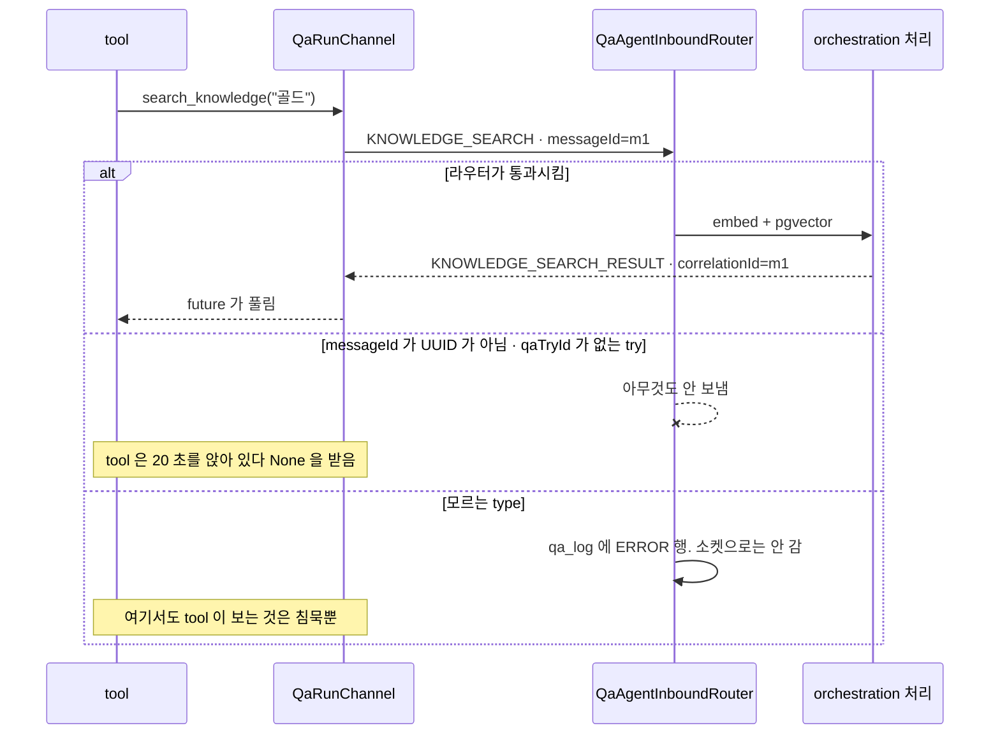

# QA protocol reference

- QA 런이 orchestration 과 `/internal/qa-sessions/{session_id}` 위에서 주고받는 것의 표
- 계약이 **철자로** 묶여 있음. 한쪽이 모르는 타입은 프레임째 버려지고, 그 버림이
  기다리는 tool 에게 **침묵**으로 도착함
- 왜 이런 모양인지는 [`docs/adr/`](adr/README.md)
- 정의는 `app/qa/envelope.py`, 상대쪽은 orchestration 의 `QaAgentInboundRouter.kt`

## 봉투

- 프레임 하나의 모양은 `messageId` · `type` · `qaTryId` · `correlationId` ·
  `sequence` · `timestamp` · `payload`
- `messageId` 는 UUID4 여야 함. 아니면 orchestration 이 아무것도 안 하고 버림
- `qaTryId` 는 JSON 숫자가 아니라 **문자열**임
- 답이 있는 프레임은 요청의 `messageId` 가 답의 `correlationId` 로 돌아옴
- `sequence` 는 채널마다 1 부터 단조 증가

## Orchestration → Agent

| type | 무엇 | 답하나 |
| --- | --- | --- |
| `GAME_STATE` | 게임이 스스로 올린 씬 스냅샷 | 아니오 |
| `PULSE` | 0.1 초마다 뜬 값을 1 초에 모아 보낸 것. orchestration 이 변환 없이 중계 | 아니오 |
| `ACTION_RESULT` | `ACTION` 배치 하나의 결과 | — |
| `CANCEL` | 런을 끝냄 | 아니오 |
| `KNOWLEDGE_SEARCH_RESULT` | `KNOWLEDGE_SEARCH` 의 답 | — |
| `KNOWLEDGE_EXPAND_RESULT` | `KNOWLEDGE_EXPAND` 의 답 | — |
| `KNOWLEDGE_WRITE_RESULT` | knowledge 쓰기 **다섯 전부**의 답. 무엇의 답인지는 `payload.type` | — |
| `SCREEN_SELECTOR_PROPOSAL` | 목록에 없는 selector 를 만났다는 질문 | QA 런은 답하지 않음 |
| `SCREEN_SETTLED` | 관측이 화면을 확정했다는 통보. `correlationId` 가 없음 | 아니오 |
| `SCREEN_SELECTOR_RESULT` | `SCREEN_SELECTOR_RULE` 과 `SCREEN_SELECTOR_VERDICT` 둘 다의 답 | — |
| `CAPABILITY_WRITE_RESULT` | capability 쓰기 둘 다의 답 | — |

## Agent → Orchestration

| type | 무엇 | 답이 오나 |
| --- | --- | --- |
| `ACTION` | 조작 요청 배치 | `ACTION_RESULT` |
| `KNOWLEDGE_SEARCH` | 프로젝트 knowledge 에 묻기 | `KNOWLEDGE_SEARCH_RESULT` |
| `KNOWLEDGE_EXPAND` | knowledge graph 를 한 항목에서 펼치기 | `KNOWLEDGE_EXPAND_RESULT` |
| `KNOWLEDGE_CREATE` · `KNOWLEDGE_UPDATE` · `KNOWLEDGE_DELETE` | 항목 쓰기 | `KNOWLEDGE_WRITE_RESULT`, **보장 안 됨** |
| `KNOWLEDGE_LINK` · `KNOWLEDGE_UNLINK` | 관계 쓰기 | `KNOWLEDGE_WRITE_RESULT`, **보장 안 됨** |
| `SCREEN_SELECTOR_RULE` | 이 scene 에서 무엇이 screen 을 가르는지 고쳐 쓰기 | `SCREEN_SELECTOR_RESULT` |
| `SCREEN_SELECTOR_VERDICT` | 제안 하나에 대한 답. **QA agent 가 아니라 판정 agent 가 보냄** | `SCREEN_SELECTOR_RESULT` |
| `CAPABILITY_VERDICT` · `CAPABILITY_DISCOVERED` | 이 런이 배운 것을 content map 에 적기 | `CAPABILITY_WRITE_RESULT` |
| `ISSUE` | 런이 찾은 결함 하나 | 아래 「`ISSUE` 는 한쪽만 옛 계약을 앎」 |
| `STATUS` | 스텝 판정과 런 종료 판정 | 아니오 |
| `LOG` | 타임라인 한 줄 | 아니오 |
| `TOOL` · `TOOL_RESULT` | 모델이 부른 tool 하나와 그것이 돌려준 것 | 아니오 |

- `TOOL` 과 `TOOL_RESULT` 는 tool 이 각자 내지 않고 러너의 `_log_reasoning` 한 곳에서 냅니다.
  개별 tool 이 스스로 남기는 방식은 새 tool 이 생길 때마다 빠뜨립니다
- `ACTION` 만으로는 부족했던 이유 — 그것은 SDK 로 나간 요청이라 조작 tool 만 남기고,
  knowledge 검색이나 스텝 판정처럼 SDK 를 안 거치는 tool 은 흔적을 안 남겼음

## 양방향

| type | 무엇 |
| --- | --- |
| `ERROR` | 거절은 요청의 `correlationId` 를 물고 옴. 아무것도 안 문 것은 통지 |
| `CHAT` | 운영자와 agent 의 대화. 한 타입으로 양쪽이고, 봉투의 방향이 화자를 정함 |

## 기다리는 tool 과 그 상한

| tool | 보내는 것 | 기다리는 것 | 상한 | 상수 |
| --- | --- | --- | --- | --- |
| 조작 tool 16 개, `capture_screen` | `ACTION` | `ACTION_RESULT` | 30.0 초 | `ACTION_TIMEOUT_SECONDS` |
| `search_knowledge` | `KNOWLEDGE_SEARCH` | `KNOWLEDGE_SEARCH_RESULT` | 20.0 초 | `KNOWLEDGE_SEARCH_TIMEOUT_SECONDS` |
| `expand_knowledge` | `KNOWLEDGE_EXPAND` | `KNOWLEDGE_EXPAND_RESULT` | 20.0 초 | `KNOWLEDGE_SEARCH_TIMEOUT_SECONDS` |
| knowledge 쓰기 5 개 | `KNOWLEDGE_*` | `KNOWLEDGE_WRITE_RESULT` | 5.0 초 | `KNOWLEDGE_WRITE_TIMEOUT_SECONDS` |
| capability 쓰기 2 개 | `CAPABILITY_*` | `CAPABILITY_WRITE_RESULT` | 5.0 초 | `KNOWLEDGE_WRITE_TIMEOUT_SECONDS` |
| `include_screen_selector` · `exclude_screen_selector` | `SCREEN_SELECTOR_RULE` | `SCREEN_SELECTOR_RESULT` | 15.0 초 | `SCREEN_SELECTOR_TIMEOUT_SECONDS` |
| `wait_for_operator` | 없음 | 운영자의 `CHAT` | 요청값, 300.0 초로 잘림 | `MAX_OPERATOR_WAIT_SECONDS` |
| `report_step` · `report_issue` · `finish_run` · `reply_to_operator` | `STATUS` · `ISSUE` · `CHAT` | 기다리지 않음 | — | — |

- 전부 `app/qa/channel.py` 의 모듈 상수입니다. **설정이 아니라 코드**라 `.env` 로 못 바꿉니다
- **쓰기가 검색의 4 분의 1 인 이유**가 이 표의 요점입니다
  - 검색은 저쪽이 query 를 embedding 하고 pgvector 를 칩니다
  - 쓰기는 답할 때쯤 이미 끝나 있는 DB statement 하나입니다
  - 그리고 정말 중요한 숫자는 **답이 안 올 때 치르는 값**입니다. ARTEL-331 이전
    orchestration 을 상대로는 모든 쓰기가 이 시간을 통째로 앉아서 기다립니다.
    쓰기마다, 런마다 치릅니다
- timeout 은 예외가 아니라 **값**으로 돌아옵니다. `None` 입니다. 서버는 느린 로드와
  죽은 게임을 구분할 수 없으므로, 다시 걸지 기다릴지 스텝을 실패로 둘지는 agent 가 정합니다

## 함정

### 1. 침묵은 「안 됐다」가 아니라 「확인 못 했다」

- knowledge 쓰기의 답은 **보장되지 않습니다.** 세 경우가 여기서 똑같이 보입니다.

| 무엇 | 쓰기가 됐나 | 답이 오나 |
| --- | --- | --- |
| orchestration 이 Agent 세션을 못 찾음 | 됨 | 안 옴 |
| 라우터가 라우팅 전에 버림 | 안 됨 | 안 옴 |
| ARTEL-331 이전 orchestration | 됨 | 안 옴 |

- 그래서 tool 이 모델에게 말하는 것은 「기록했다」가 아니라 **「보냈다」**이고,
  다시 쓰라고 하지 않습니다.
- `None` 을 실패로 보고하면 모델이 같은 사실을 또 씁니다. 이 계약이 막으려는 중복이
  정확히 그것입니다.

### 2. 모르는 type 은 프레임째 버려지고, 그 버림이 소켓으로 안 옵니다

- orchestration 의 `SUPPORTED_TYPES` 에 없는 타입은 `appendError` 로 갑니다.
- `appendError` 가 하는 일은 `qa_log` 에 `ORCHE_INTERNAL` 방향의 `ERROR` 행을 적고
  SSE 로 발행하는 것뿐입니다. **agent 소켓으로는 아무것도 안 갑니다.**
- 거절은 운영자 타임라인에 뜨고, 기다리던 tool 은 제 timeout 까지 앉아 있습니다.
- 그래서 `app/qa/envelope.py` 의 이름은 **저쪽 철자와 정확히 같아야 합니다.**
  한 글자가 다르면 오류가 아니라 침묵으로 나타납니다.
- 반대 방향도 같습니다. agent-server 의 `deliver()` 가 모르는 타입은 `False` 로 떨어져
  「unsupported inbound frame」으로 답하는데, 그 답은 저쪽에 프로토콜 오류로 읽힙니다.
  그래서 `SCREEN_SELECTOR_PROPOSAL` 처럼 **답할 생각이 없는 프레임도 반드시 받아야 합니다.**

### 3. `qa_try_id` 가 없는 try 를 가리키면 조용히 버려집니다 — 소켓은 안 죽습니다

- `parseId(envelope.qaTryId) ?: return` 과 `activeTry(qaTryId) ?: return` 둘 다
  값을 돌려주지 않고 그냥 돌아갑니다. 답도 없습니다.
- **이것이 의도입니다.** 저쪽 주석이 이유를 적습니다 — 여기서 예외를 던지면 그것이
  WebSocket receive 체인 밖으로 나가 소켓을 닫고, 그 닫힘이 `onDisconnect` 로 이어져
  런 전체를 실패로 만듭니다.
- 그러므로 correlation 에 park 하는 tool 은 **자기 timeout 을 스스로 들고 있어야 합니다.**
  저쪽이 답을 안 줄 수 있는 경로가 둘이나 있기 때문입니다.
- 이 저장소 `app/api/sessions.py` 의 주석은 아직 「그 거절이 WebSocket 을 죽이고 런을
  실패시킨다」고 적고 있습니다. **저쪽 코드가 이깁니다** — 지금은 죽이지 않습니다.
  다만 언제나 진짜 try 를 적으라는 그 주석의 결론 자체는 여전히 옳습니다.

### 4. `ISSUE` 는 한쪽만 옛 계약을 압니다

- `IssueSeverity` 사다리는 양쪽이 똑같습니다 —
  `BLOCKER` · `CRITICAL` · `MAJOR` · `MINOR` · `TRIVIAL`.
- `report_issue` 는 `title` 과 `severity` 를 **스스로** 검사하고, 틀리면 프레임을
  보내지도 않고 모델에게 다시 부르라고 말합니다.
- 그 검사가 생긴 이유는 옛 계약입니다 — 예전에는 성공이 침묵이고 거절도 운영자
  타임라인의 `ERROR` 행뿐이라, severity 오타 하나면 버그 보고가 조용히 사라지고
  모델은 보고했다고 믿었습니다.
- **ARTEL-366 이 그것을 고쳤습니다.** 지금 orchestration 은 성공에 `ISSUE_RESULT` 를,
  거절에 correlation 을 문 `ERROR` 를 돌려줍니다.
- 그런데 **이 저장소에는 `ISSUE_RESULT` 라는 `MessageType` 이 없습니다.** 그 프레임이
  오면 `deliver()` 가 모르는 타입으로 떨어뜨려 「unsupported inbound frame」으로 답합니다.
- 지금은 무해합니다. `report_issue` 가 아무것도 기다리지 않기 때문입니다.
  `app/qa/envelope.py` 의 `ISSUE` 주석은 **낡았습니다** — 저쪽은 더 이상 한쪽 방향이 아닙니다.

### 5. 시나리오 WebSocket 은 다른 프로토콜입니다

- `/internal/sessions/{session_id}` 는 이 봉투를 안 씁니다. **평평한 JSON** 입니다.
- `messageId` 도 `qaTryId` 도 `correlationId` 도 `sequence` 도 없습니다.

| 방향 | type |
| --- | --- |
| 들어옴 | `turn`, `close`, `test_case_search_result` |
| 나감 | `result`, `error`, `closed`, `progress`, `test_case_search`, `submit_scenario`, `uncovered_cases`, `find_path` |

- **세션 하나에 turn 하나입니다.** 돌고 있는 turn 이 있는데 `turn` 이 또 오면
  `{"type": "error", "code": "busy", "detail": "A turn is already in progress."}` 로 답합니다.
- 두 번째 turn 을 받으면 같은 채널과 waiter 위에서 agent loop 둘이 경합합니다.
- `search_test_cases` tool 이 `search_knowledge` 의 구조를 일부러 따라 하지만,
  **wire 가 다르므로 프레임 모양은 `app/sessions/channel.py` 가 따로 소유합니다.**

## orchestration 으로 나가는 HTTP 둘

| 무엇 | 경로 | 언제 |
| --- | --- | --- |
| LLM 사용량 | `POST /internal/llm-usage` | 배치가 크기나 주기 중 먼저 걸리는 쪽에서 나감 |
| scene context | `GET /internal/projects/{project_id}/game-builds/{game_build_id}/scene-context` | 시나리오마다 한 번, agent 의 첫 턴 앞에서 |

- **사용량 수집은 일부러 손실을 허용합니다.** 받는 endpoint 에 idempotency key 가 없어,
  이미 도착한 배치를 다시 보내면 같은 지출이 두 번 적힙니다.
  - 실패한 전송은 그 배치를 버리고 한 줄을 남깁니다
  - `LLM_USAGE_MAX_BUFFER` 를 넘긴 backlog 는 오래된 것부터 버립니다
  - 회계가 QA 런을 죽이는 이유가 되어서도, 이 프로세스의 메모리를 말리는 이유가
    되어서도 안 되기 때문입니다
- scene context 는 5.0 초에 끊습니다. 런이 그것을 기다리고 있고 답은 참고 자료입니다

## `GAME_STATE` 는 지금 0 장이 정상입니다

- artel-sdk 의 ARTEL-400 이 그것을 내던 poller 를 지웁니다. 그러면 `GAME_STATE` 가
  영영 안 옵니다.
- **그래도 핸들러는 남아야 합니다.** 등록되지 않은 타입은 §2 대로 프레임째 거절되고,
  그 거절이 저쪽에 프로토콜 오류로 읽힙니다.
- `on_game_state` 는 풀어 줄 future 가 없습니다. agent 가 화면을 묻지 않기 때문입니다 —
  여기 오는 프레임은 전부 게임이 스스로 올린 것이고, tool 을 풀어 주는 것은
  action 의 `ACTION_RESULT` 입니다.
- 실측 런 하나에서 **`GAME_STATE` 가 0 장, `PULSE` 가 14,489 장**이었습니다
  (`app/qa/scene.py:386`). 그 런에서 화면을 그리는 자리는 `pulse` branch 하나뿐이었습니다.
- orchestration 쪽 `ScreenSelectorFrames.kt` 가 같은 런의 `pulse` 를 14,489 로 적고
  그 런이 남긴 화면을 3 행으로 적습니다.
